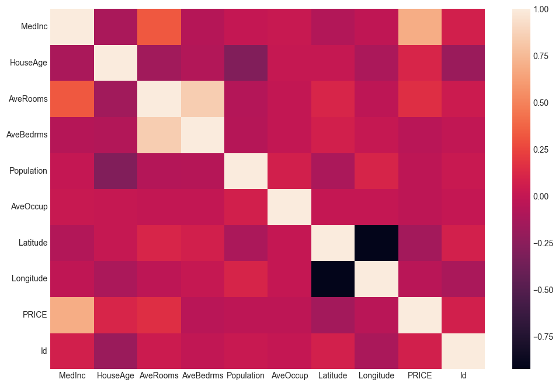
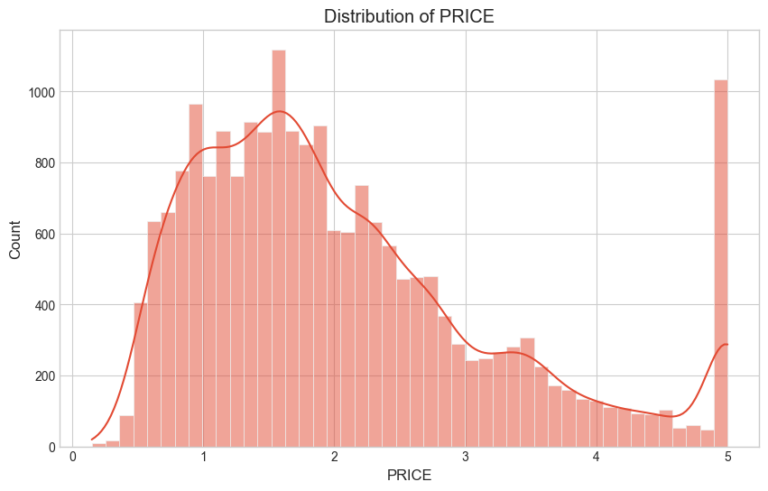
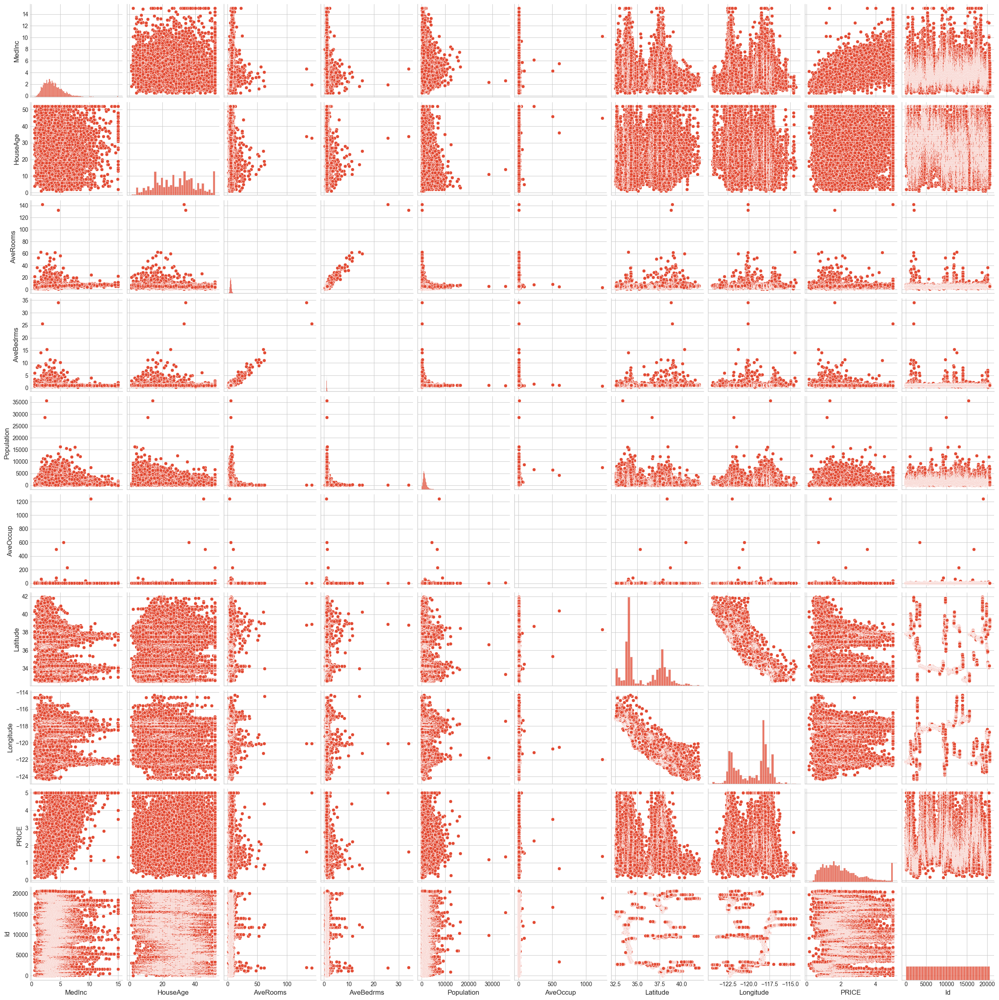
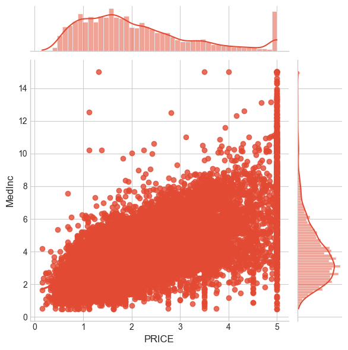
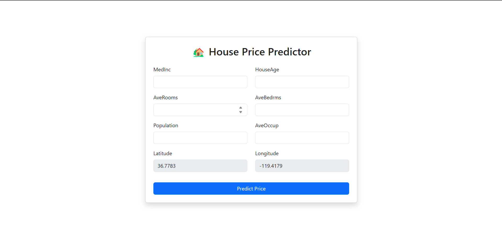
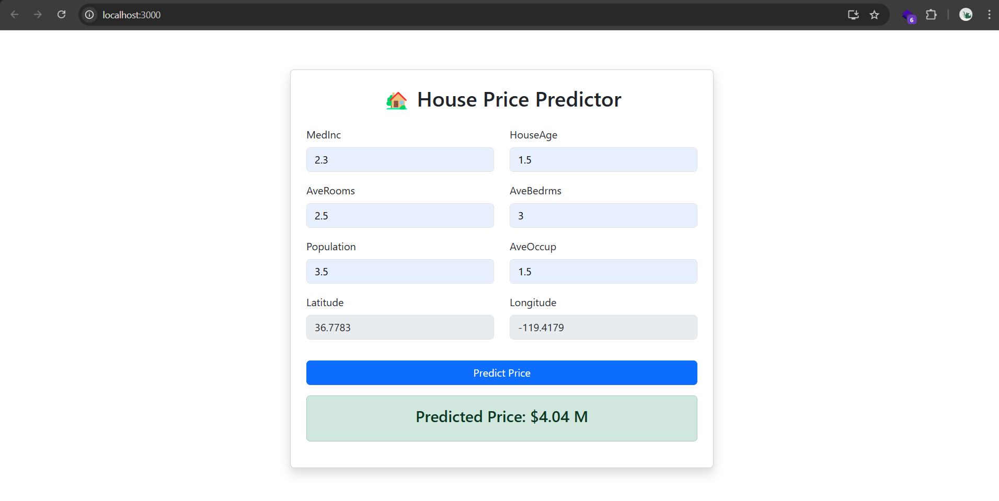

# 🏡 House Price Prediction

## 📌 Overview

This project is a **House Price Prediction System** using **Machine Learning**, deployed via a **Flask API**, and featuring a **ReactJS frontend** for user interaction.

## 📂 Project Structure

```
House-Price-Prediction/
│── frontend/               # React frontend (UI for user input)
│── backend/                # Flask API
│   │── app.py              # Flask application
│   │── house_price_model.pkl # Trained model (XGBoost)
│── notebooks/              # Jupyter Notebook for model training
│   │── housing_price_predict.ipynb
│── models/                 # Saved models
│── requirements.txt        # Dependencies
│── README.md               # Documentation
```

---

## 🛠 Installation & Setup

### 1️⃣ Clone the Repository

```bash
git clone <repository-url>
cd House-Price-Prediction
```

### 2️⃣ Set Up Virtual Environment & Install Dependencies

```bash
python -m venv venv
source venv/bin/activate  # On Windows use: venv\Scripts\activate
pip install -r requirements.txt
```

---

## 🔄 Process of Work

### 📊 Exploratory Data Analysis (EDA)

- Data distribution and feature correlation analysis.
- Visualizing missing values and feature importance.

#### Example Visualizations:

<div align="center">
    <h4>Feature Correlation & Price Distribution</h4>
    <table>
        <tr>
            <td align="center">
                
                <p><b>Feature Correlation</b></p>
            </td>
            <td align="center">
                
                <p><b>Price Distribution</b></p>
            </td>
        </tr>
    </table>
    <h4>Pair Plots</h4>
    <table>
        <tr>
            <td align="center">
                
                <p><b>Pair Plot</b></p>
            </td>
            <td align="center">
                
                <p><b>Pair Plot of Most Correlated Feature</b></p>
            </td>
        </tr>
    </table>
</div>


### 📊 Model Training

1. **Data Preprocessing**
   - Handle missing values, feature scaling, and encoding categorical variables.
   - Perform feature engineering to improve model performance.
2. **Model Selection**
   - Tested multiple regression models:
     ```python
     models = {
        'Ridge': Ridge(alpha=1.0, random_state=42),
        'Lasso': Lasso(alpha=0.001, random_state=42),
        'RandomForest': RandomForestRegressor(n_estimators=100, random_state=42),
        'XGBoost': xgb.XGBRegressor(n_estimators=100, learning_rate=0.1, random_state=42),
        'LightGBM': lgb.LGBMRegressor(n_estimators=100, learning_rate=0.1, random_state=42),
        'LinearRegression': LinearRegression()
     }
     ```
   - Evaluated models based on RMSE, MAE, and R² score.
   - Selected **XGBoost** as the best model.
3. **Model Deployment**
   - Saved the trained model as `house_price_model.pkl`.

---

## 🚀 Running the Application

### 1️⃣ Start the Flask API

The **`app.py`** file:

- Loads the trained model (`house_price_model.pkl`).
- Accepts house features via a **POST** request.
- Predicts the house price and returns a JSON response.

#### Run the API

```bash
cd backend/
python app.py
```

- The API will start at **[http://127.0.0.1:5000/](http://127.0.0.1:5000/)**.

#### Test the API

Use **Postman** or `curl` to send a request:

```bash
curl -X POST http://127.0.0.1:5000/predict \
-H "Content-Type: application/json" \
-d '{"features": [0.245678, 0.612345, 0.389456, -0.089234, -0.654321, 0.032145, 0.472839, -0.102345, -0.752134, 0.189432, -0.845678]}'
```

##### Expected Response:

```json
{
    "predicted_price": [0.7473676204681396]
}
```

---

### 2️⃣ Run the React Frontend

The frontend allows users to input house features and get predictions.

#### Run Frontend

```bash
cd frontend/
npm install
npm start
```

- The UI will be available at **[http://localhost:3000/](http://localhost:3000/)**.

#### Frontend Features:

- **Form Input:** Users enter house features.
- **Prediction Display:** Shows predicted price from the backend.
- **Bootstrap Styling:** Responsive UI.

#### Frontend UI Preview:

<div style="display: flex; justify-content: space-between; align-items: center; width: 100%; max-width: 1000px; margin: auto;">
    <div style="flex: 1; text-align: center; padding: 10px;">
        <h4>Frontend Form</h4>
        
    </div>
    <div style="flex: 1; text-align: center; padding: 10px;">
        <h4>Prediction Display</h4>
        
    </div>
</div>


---

## 📊 Model Performance

- **Algorithm Used:** XGBoost
- **Evaluation Metrics:**
  - RMSE: 0.485181
  - MAE: 0.327218
  - R² Score: 0.829419

---

## 🌍 Deployment (Optional)

To deploy the Flask app:

- **Containerization:** Use Docker (`Dockerfile` included).
- **Cloud Deployment:** Deploy on AWS, GCP, or Heroku.

---

## 🔥 Future Improvements

- Improve model accuracy using advanced feature engineering.
- Implement authentication in the API.
- Deploy the project on cloud platforms.

## 👨‍💻 Contributors

Md Shafiullah Quraishi

---

**Note:** This is a personal project for learning and practice purposes.

